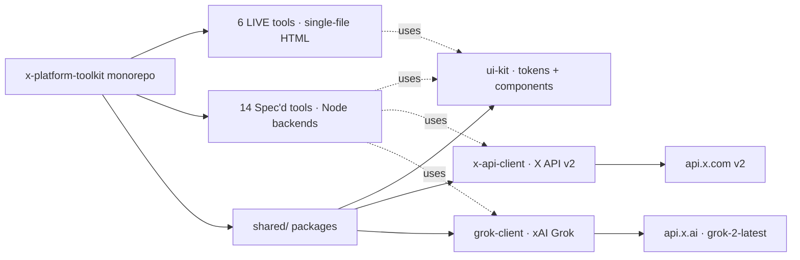

<!-- NEON / CYBERPUNK REPO TEMPLATE · X-PLATFORM-TOOLKIT -->

<p align="center">
  
</p>

<h1 align="center">⚡ x-platform-toolkit</h1>

<p align="center">
  <b>20 tools. One monorepo. Everything X should have shipped and didn't.</b><br/>
  Neon-native · Grok-aware · Self-hostable · ToS-respecting.
</p>

<p align="center">
  
</p>

<p align="center">
  
  
  
  
  
  
</p>

<p align="center">
  <a href="#-the-20-tools"><b>Tools</b></a> ·
  <a href="docs/PHILOSOPHY.md"><b>Philosophy</b></a> ·
  <a href="docs/ARCHITECTURE.md"><b>Architecture</b></a> ·
  <a href="docs/BRAND.md"><b>Brand</b></a> ·
  <a href="docs/ROADMAP.md"><b>Roadmap</b></a> ·
  <a href="CHANGELOG.md"><b>Changelog</b></a> ·
  <a href="CONTRIBUTING.md"><b>Contribute</b></a>
</p>

---

## ✦ The Why

X has **600M+ users** and a public API. Yet the platform itself ships only ~10% of the tools its power users actually need.

This toolkit fills the gap. Every tool here works with public X data, the official X API v2, or xAI's Grok API. **Nothing here violates ToS.** Everything here is yours to fork, self-host, or extend.

## ✦ By The Numbers

<table>
  <tr>
    <td width="25%" align="center">
      <h1 style="color:#00E5FF">20</h1>
      <p><b>Tools</b><br/><sub>across 6 categories</sub></p>
    </td>
    <td width="25%" align="center">
      <h1 style="color:#7C3AED">6</h1>
      <p><b>Live</b><br/><sub>single-file HTML, ship today</sub></p>
    </td>
    <td width="25%" align="center">
      <h1 style="color:#FF4FD8">14</h1>
      <p><b>Spec'd</b><br/><sub>designed, ready to build</sub></p>
    </td>
    <td width="25%" align="center">
      <h1 style="color:#00D5FF">0</h1>
      <p><b>ToS violations</b><br/><sub>public data + official APIs only</sub></p>
    </td>
  </tr>
</table>

## ✦ Categories

<table>
  <tr>
    <td width="33%">
      <h3>📊 Analytics · 7</h3>
      <p>Thread decay, follower intent, engagement quality, niche benchmarking, velocity maps.</p>
    </td>
    <td width="33%">
      <h3>✍️ AI Writing · 5</h3>
      <p>Contextual replies, ghostwriter with memory, thread composer, article optimizer, newsletter converter.</p>
    </td>
    <td width="33%">
      <h3>🤖 AI Analytics · 3</h3>
      <p>Pre-post virality, controversy detection, emotional tone trends.</p>
    </td>
  </tr>
  <tr>
    <td>
      <h3>⚙️ Automation · 2</h3>
      <p>Pinned-post A/B rotator, post necromancer for dormant content.</p>
    </td>
    <td>
      <h3>💰 Monetization · 1</h3>
      <p>Digital product storefront — bypass X's payment bottleneck.</p>
    </td>
    <td>
      <h3>🌐 Network + Media · 2</h3>
      <p>Warm-introduction mapper, Spaces recorder with auto-clips.</p>
    </td>
  </tr>
</table>

## ✦ The 20 Tools

| # | Tool | Category | Status | Stack |
|---|---|---|---|---|
| 01 | [Thread Decay Tracker](tools/01-thread-decay-tracker/) | Analytics | `Spec'd` | Node + X API |
| 02 | [Follower Intent Classifier](tools/02-follower-intent-classifier/) | Analytics | `Spec'd` | Node + X API + Grok |
| 03 | [Contextual Reply Suggester](tools/03-contextual-reply-suggester/) | AI Writing | `Spec'd` | Grok |
| 04 | [Pre-Post Virality Scorer](tools/04-pre-post-virality-scorer/) | AI Analytics | `Live` | Vanilla JS |
| 05 | [Pinned Post A/B Rotator](tools/05-pinned-post-ab-rotator/) | Automation | `Live` | Vanilla JS |
| 06 | [Digital Product Storefront](tools/06-digital-product-storefront/) | Monetization | `Spec'd` | Next.js + Firebase |
| 07 | [Content Compound Calculator](tools/07-content-compound-calculator/) | Analytics | `Live` | Vanilla JS + Chart.js |
| 08 | [Follow/Unfollow Velocity Map](tools/08-follow-unfollow-velocity-map/) | Analytics | `Spec'd` | Node + X API |
| 09 | [Engagement Quality Score](tools/09-engagement-quality-score/) | Analytics | `Live` | Vanilla JS |
| 10 | [Cross-Account Niche Benchmarker](tools/10-cross-account-niche-benchmarker/) | Analytics | `Spec'd` | Node + X API |
| 11 | [Ghostwriter Mode with Memory](tools/11-ghostwriter-mode-with-memory/) | AI Writing | `Spec'd` | Node + Grok |
| 12 | [Controversy Detector](tools/12-controversy-detector/) | AI Analytics | `Live` | Vanilla JS |
| 13 | [Thread-to-Newsletter Converter](tools/13-thread-to-newsletter-converter/) | Automation | `Spec'd` | Node + Grok |
| 14 | [Warm Introduction Mapper](tools/14-warm-introduction-mapper/) | Network | `Spec'd` | Node + X API |
| 15 | [Spaces Recorder + Clips](tools/15-spaces-recorder-clips/) | Media | `Spec'd` | Node + FFmpeg |
| 16 | [Follower Migration Assistant](tools/16-follower-migration-assistant/) | Analytics | `Spec'd` | Node + Grok |
| 17 | [Post Necromancer](tools/17-post-necromancer/) | AI Automation | `Spec'd` | Node + Grok |
| 18 | [Emotional Tone Trend Tracker](tools/18-emotional-tone-trend-tracker/) | AI Analytics | `Live` | Vanilla JS + Chart.js |
| 19 | [Grok Thread Composer](tools/19-grok-thread-composer/) | AI Writing (xAI) | `Spec'd` | Grok |
| 20 | [X Articles Optimizer](tools/20-x-articles-optimizer/) | AI Writing | `Spec'd` | Grok |

## ✦ Quick Start

```bash
git clone https://github.com/AgentMindCloud/x-platform-toolkit.git
cd x-platform-toolkit/tools/04-pre-post-virality-scorer
open index.html
```

**Every LIVE tool is a single HTML file.** No build step. No dependencies beyond a CDN for charting where needed. Open it, use it, ship it.

## ✦ Architecture



A monorepo of numbered tool folders, a shared UI kit, and thin API clients for X and Grok. LIVE tools ship as single-file HTML; backend-driven tools are plain Node. Full detail: [`docs/ARCHITECTURE.md`](docs/ARCHITECTURE.md).

### Shared packages

| Package | Purpose | Env |
|---|---|---|
| [`shared/ui-kit`](shared/ui-kit/) | Design tokens, components, shell template | — |
| [`shared/x-api-client`](shared/x-api-client/) | X API v2 wrapper (Node ≥18) | `X_BEARER_TOKEN` |
| [`shared/grok-client`](shared/grok-client/) | xAI Grok API wrapper (Node ≥18), defaults to `grok-2-latest` | `XAI_API_KEY` |

Visual system lives in [`docs/BRAND.md`](docs/BRAND.md).

## ✦ Philosophy

<table>
  <tr>
    <td width="50%">
      <h3>🌐 Open by Default</h3>
      <p>Apache 2.0. Fork it, self-host it, extend it, sell services on top of it. No strings.</p>
    </td>
    <td width="50%">
      <h3>🛡️ ToS-Respecting</h3>
      <p>Public data + official X API v2 + xAI Grok API. Nothing scraped. Nothing grey.</p>
    </td>
  </tr>
  <tr>
    <td>
      <h3>⚡ Single-File When Possible</h3>
      <p>LIVE tools are vanilla HTML. Open in a browser, done. No npm, no build, no Docker.</p>
    </td>
    <td>
      <h3>🎨 Premium Aesthetic</h3>
      <p>Neon-dark, glass, motion. These tools look like products, not weekend hacks.</p>
    </td>
  </tr>
</table>

Full statement: [`docs/PHILOSOPHY.md`](docs/PHILOSOPHY.md).

## ✦ Contributing

Issues, tool requests, and PRs all welcome. Start with [`CONTRIBUTING.md`](CONTRIBUTING.md).

**Want to claim a Spec'd tool and ship it?** Open an issue with the tool number in the title — first-come-first-served, I'll help you scope and review.

## ✦ Sibling Repos

<table>
  <tr>
    <td width="33%">
      <h3>📦 grok-install</h3>
      <p>The universal YAML spec for Grok-native agents.</p>
      <a href="https://github.com/agentmindcloud/grok-install">Repository →</a>
    </td>
    <td width="33%">
      <h3>⚙️ grok-install-cli</h3>
      <p>The CLI for shipping Grok agents from YAML.</p>
      <a href="https://github.com/agentmindcloud/grok-install-cli">Repository →</a>
    </td>
    <td width="33%">
      <h3>🌟 awesome-grok-agents</h3>
      <p>10 certified agent templates, end-to-end runnable.</p>
      <a href="https://github.com/agentmindcloud/awesome-grok-agents">Repository →</a>
    </td>
  </tr>
  <tr>
    <td>
      <h3>🛒 grok-agents-marketplace</h3>
      <p>The live marketplace at <a href="https://grokagents.dev">grokagents.dev</a>.</p>
      <a href="https://github.com/agentmindcloud/grok-agents-marketplace">Repository →</a>
    </td>
    <td>
      <h3>🎭 grok-agent-orchestra</h3>
      <p>Multi-agent runtime with mandatory safety veto.</p>
      <a href="https://github.com/agentmindcloud/grok-agent-orchestra">Repository →</a>
    </td>
    <td>
      <h3>📚 grok-docs</h3>
      <p>Full documentation site.</p>
      <a href="https://github.com/agentmindcloud/grok-docs">Repository →</a>
    </td>
  </tr>
</table>

## ✦ Connect

<p align="center">
  <a href="https://github.com/agentmindcloud">
    
  </a>
  <a href="https://x.com/JanSol0s">
    
  </a>
  <a href="https://www.jansolos.com">
    
  </a>
</p>

## ✦ License

Apache 2.0. Built in Ho Chi Minh City. Part of the **grok-install** family.

<p align="center">
  
</p>
