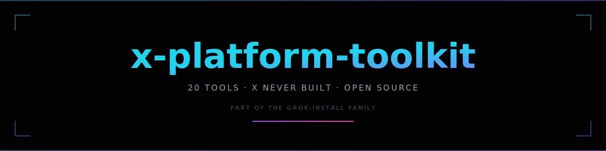

<div align="center"></div>

<div align="center"><strong>The open toolkit for X creators, builders, and analysts.</strong></div>

<div align="center"><em>Part of the grok-install family — neon-native, Grok-aware, self-hostable.</em></div>

<br/>

<div align="center">


</div>

<div align="center">[ <a href="#tools">Tools</a> ] [ <a href="docs/PHILOSOPHY.md">Philosophy</a> ] [ <a href="docs/ARCHITECTURE.md">Architecture</a> ] [ <a href="docs/ROADMAP.md">Roadmap</a> ] [ <a href="CONTRIBUTING.md">Contribute</a> ]</div>

---

## The Why

X has 600M+ users and a public API. Yet the platform itself ships only ~10% of the tools its power users actually need. This toolkit fills the gap. Every tool here works with public X data, the official X API v2, or xAI's Grok API. Nothing here violates ToS. Everything here is yours to fork, self-host, or extend.

## Tools

| # | Tool | Category | Status | Stack |
|---|---|---|---|---|
| 01 | [Thread Decay Tracker](tools/01-thread-decay-tracker/) | Analytics | `Spec'd` | Node + X API |
| 02 | [Follower Intent Classifier](tools/02-follower-intent-classifier/) | Analytics | `Spec'd` | Node + X API + Grok |
| 03 | [Contextual Reply Suggester](tools/03-contextual-reply-suggester/) | AI Writing | `Spec'd` | Grok |
| 04 | [Pre-Post Virality Scorer](tools/04-pre-post-virality-scorer/) | AI Analytics | `Live` | Vanilla JS |
| 05 | [Pinned Post A/B Rotator](tools/05-pinned-post-ab-rotator/) | Automation | `Spec'd` | Vanilla JS |
| 06 | [Digital Product Storefront](tools/06-digital-product-storefront/) | Monetization | `Spec'd` | Next.js + Firebase |
| 07 | [Content Compound Calculator](tools/07-content-compound-calculator/) | Analytics | `Live` | Vanilla JS + Chart.js |
| 08 | [Follow/Unfollow Velocity Map](tools/08-follow-unfollow-velocity-map/) | Analytics | `Spec'd` | Node + X API |
| 09 | [Engagement Quality Score](tools/09-engagement-quality-score/) | Analytics | `Live` | Vanilla JS |
| 10 | [Cross-Account Niche Benchmarker](tools/10-cross-account-niche-benchmarker/) | Analytics | `Spec'd` | Node + X API |
| 11 | [Ghostwriter Mode with Memory](tools/11-ghostwriter-mode-with-memory/) | AI Writing | `Spec'd` | Node + Grok |
| 13 | [Thread-to-Newsletter Converter](tools/13-thread-to-newsletter-converter/) | Automation | `Spec'd` | Node + Grok |
| 14 | [Warm Introduction Mapper](tools/14-warm-introduction-mapper/) | Network | `Spec'd` | Node + X API |
| 15 | [Spaces Recorder + Clips](tools/15-spaces-recorder-clips/) | Media | `Spec'd` | Node + FFmpeg |
| 16 | [Follower Migration Assistant](tools/16-follower-migration-assistant/) | Analytics | `Spec'd` | Node + Grok |
| 17 | [Post Necromancer](tools/17-post-necromancer/) | AI Automation | `Spec'd` | Node + Grok |
| 18 | [Emotional Tone Trend Tracker](tools/18-emotional-tone-trend-tracker/) | AI Analytics | `Live` | Vanilla JS + Chart.js |
| 19 | [Grok Thread Composer](tools/19-grok-thread-composer/) | AI Writing (xAI) | `Spec'd` | Grok |
| 20 | [X Articles Optimizer](tools/20-x-articles-optimizer/) | AI Writing | `Spec'd` | Grok |

## Quick Start

```bash
git clone https://github.com/AgentMindCloud/x-platform-toolkit.git
cd x-platform-toolkit/tools/04-pre-post-virality-scorer
open index.html
```

Every LIVE tool is a single HTML file. No build step. No dependencies beyond a CDN for charting where needed.

## Architecture

A monorepo of numbered tool folders, a shared UI kit, and thin API clients for X and Grok. LIVE tools ship as single-file HTML; backend-driven tools are plain Node. See [docs/ARCHITECTURE.md](docs/ARCHITECTURE.md).

## Philosophy

Open source by default. ToS-respecting. Self-hostable. Premium aesthetic. Solo-builder friendly. Read the full statement: [docs/PHILOSOPHY.md](docs/PHILOSOPHY.md).

## Contributing

Issues, tool requests, and PRs all welcome. Start with [CONTRIBUTING.md](CONTRIBUTING.md).

---

```
────────────────────────────────────────────────────
Part of the grok-install family.
Built in Ho Chi Minh City. Apache 2.0.
────────────────────────────────────────────────────
```
